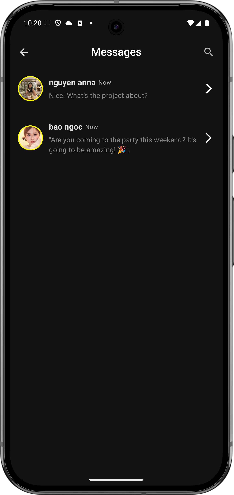
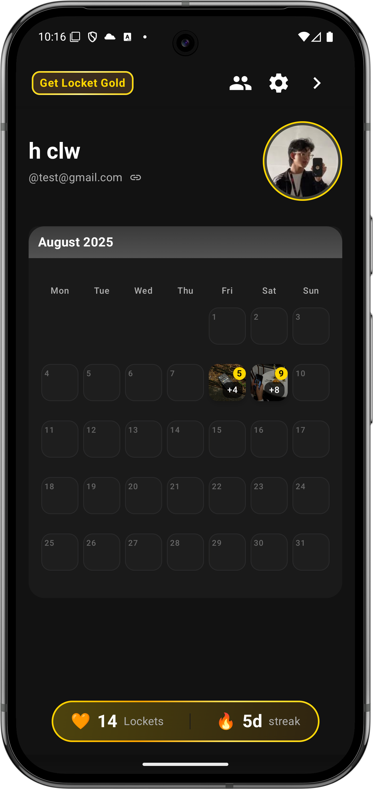
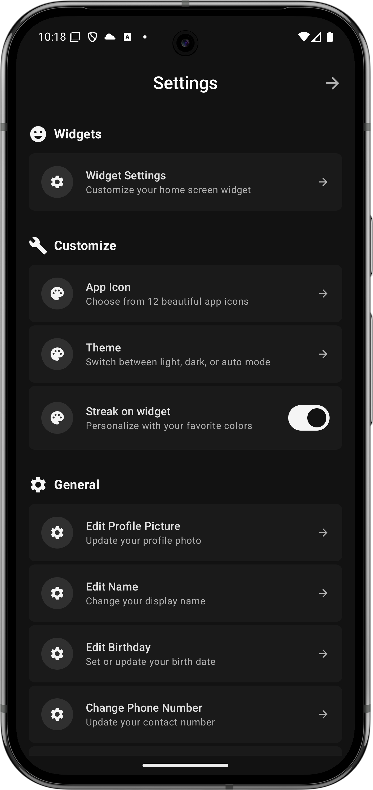

# 📸 Nocket App

[](https://kotlinlang.org/)
[](https://developer.android.com/jetpack/compose)
[](https://dagger.dev/hilt/)
[](https://appwrite.io/)
[](LICENSE)

> **A modern Android prototype** of a social camera app built with Kotlin and Jetpack Compose.  
> Features a clean Material 3 UI, smooth navigation, previewable components, and an Appwrite-backed data layer.

<div style="
    display: flex;
    align-items: center;
    flex-wrap: wrap;
    gap: 12px;
    font-family: 'Segoe UI', Roboto, sans-serif;
">
  
  <a href="#-highlights" style="
      flex: 1 1 calc(50% - 12px);
      background: #ffffff;
      border: 1px solid #e0e0e0;
      border-radius: 10px;
      padding: 12px;
      text-decoration: none;
      color: #2b6cb0;
      box-shadow: 0 2px 5px rgba(0,0,0,0.05);
      transition: all 0.2s ease;
      display: flex;
      align-items: center;
      font-weight: 500;
  " onmouseover="this.style.background='#f7fafc'" onmouseout="this.style.background='#ffffff'">
      ✨ Highlights
  </a>

<a href="#-screens" style="
      flex: 1 1 calc(50% - 12px);
      background: #ffffff;
      border: 1px solid #e0e0e0;
      border-radius: 10px;
      padding: 12px;
      text-decoration: none;
      color: #2b6cb0;
      box-shadow: 0 2px 5px rgba(0,0,0,0.05);
      transition: all 0.2s ease;
      display: flex;
      align-items: center;
      font-weight: 500;
  " onmouseover="this.style.background='#f7fafc'" onmouseout="this.style.background='#ffffff'">
🖼 Screens
</a>

<a href="#-project-structure" style="
      flex: 1 1 calc(50% - 12px);
      background: #ffffff;
      border: 1px solid #e0e0e0;
      border-radius: 10px;
      padding: 12px;
      text-decoration: none;
      color: #2b6cb0;
      box-shadow: 0 2px 5px rgba(0,0,0,0.05);
      transition: all 0.2s ease;
      display: flex;
      align-items: center;
      font-weight: 500;
  " onmouseover="this.style.background='#f7fafc'" onmouseout="this.style.background='#ffffff'">
📂 Project Structure
</a>

<a href="#-tech-stack" style="
      flex: 1 1 calc(50% - 12px);
      background: #ffffff;
      border: 1px solid #e0e0e0;
      border-radius: 10px;
      padding: 12px;
      text-decoration: none;
      color: #2b6cb0;
      box-shadow: 0 2px 5px rgba(0,0,0,0.05);
      transition: all 0.2s ease;
      display: flex;
      align-items: center;
      font-weight: 500;
  " onmouseover="this.style.background='#f7fafc'" onmouseout="this.style.background='#ffffff'">
🛠 Tech Stack
</a>

<a href="#-appwrite-setup" style="
      flex: 1 1 calc(50% - 12px);
      background: #ffffff;
      border: 1px solid #e0e0e0;
      border-radius: 10px;
      padding: 12px;
      text-decoration: none;
      color: #2b6cb0;
      box-shadow: 0 2px 5px rgba(0,0,0,0.05);
      transition: all 0.2s ease;
      display: flex;
      align-items: center;
      font-weight: 500;
  " onmouseover="this.style.background='#f7fafc'" onmouseout="this.style.background='#ffffff'">
⚙ Appwrite Setup
</a>

<a href="#-roadmap-ideas" style="
      flex: 1 1 calc(50% - 12px);
      background: #ffffff;
      border: 1px solid #e0e0e0;
      border-radius: 10px;
      padding: 12px;
      text-decoration: none;
      color: #2b6cb0;
      box-shadow: 0 2px 5px rgba(0,0,0,0.05);
      transition: all 0.2s ease;
      display: flex;
      align-items: center;
      font-weight: 500;
  " onmouseover="this.style.background='#f7fafc'" onmouseout="this.style.background='#ffffff'">
🚀 Roadmap Ideas
</a>

</div>

## ✨ Highlights

- **UI:** Jetpack Compose + Material 3, dark/light themes, and previews
- **Navigation:** Navigation Compose + top bars
- **Media:** Image loading with Coil
- **Architecture:** MVVM architecture, Hilt for DI, Retrofit (stub) + OkHttp
- **Backend:** Appwrite SDK integration via type-safe `BuildConfig` fields

## 🖼 Screens

<div align="center">
  <table>
    <tr><th colspan="3">📱 Screen Previews</th></tr>
    <tr>
      <td align="center"><br/>Posts</td>
      <td align="center"><br/>Friend List</td>
      <td align="center"><br/>Camera</td>
    </tr>
    <tr>
      <td align="center"><br/>Submit Photo</td>
      <td align="center"><br/>Messages</td>
      <td align="center"><br/>Profile</td>
    </tr>
    <tr>
      <td align="center"><br/>Settings</td>
      <td align="center"><br/>Logo</td>
      <td align="center"><br/>Splash Screen</td>
    </tr>
  </table>
</div>

> 📌 **Reference:** See navigation routes in  
> `app/src/main/java/com/example/nocket/Navigation.kt`

## 📂 Project Structure

```
components/     → Reusable UI: top bars, pills, lists, grids, etc.
ui/screen/      → Feature screens (post, message, profile, camera, submit photo)
data/           → SampleData for previews and demo
di/             → Hilt modules (e.g., AppwriteModule.kt)
repositories/   → Data sources (e.g., AppwriteRepository.kt)
viewmodels/     → State holders (e.g., AppwriteViewModel.kt)
constants/      → AppwriteConfig.kt bridges BuildConfig to the app
```

## 🛠 Tech Stack

| Layer          | Technology                   |
| -------------- | ---------------------------- |
| **Language**   | Kotlin                       |
| **UI**         | Jetpack Compose + Material 3 |
| **Navigation** | Navigation Compose           |
| **DI**         | Hilt                         |
| **Networking** | Retrofit, OkHttp, Gson       |
| **Media**      | Coil                         |
| **Backend**    | Appwrite Android SDK         |

---

## ⚙ Appwrite Setup

This project reads Appwrite settings from `local.properties` and exposes them as `BuildConfig` fields.

**Required Keys:**

```properties
appwrite.version=1.6.0
appwrite.project.id=YOUR_PROJECT_ID
appwrite.project.name=YOUR_PROJECT_NAME
appwrite.endpoint=https://<your-endpoint>/v1
```

**How it works:**

1. `app/build.gradle.kts` loads these values and generates `BuildConfig` constants.
2. `AppwriteConfig.kt` exposes them as `APPWRITE_*` constants.
3. `di/AppwriteModule.kt` configures the Appwrite `Client`, `Account`, and `Databases`.

---

## 🚀 Roadmap Ideas

- Replace `SampleData` with real Appwrite repositories
- Add authentication flow & real-time updates
- Expand test coverage + UI tests
